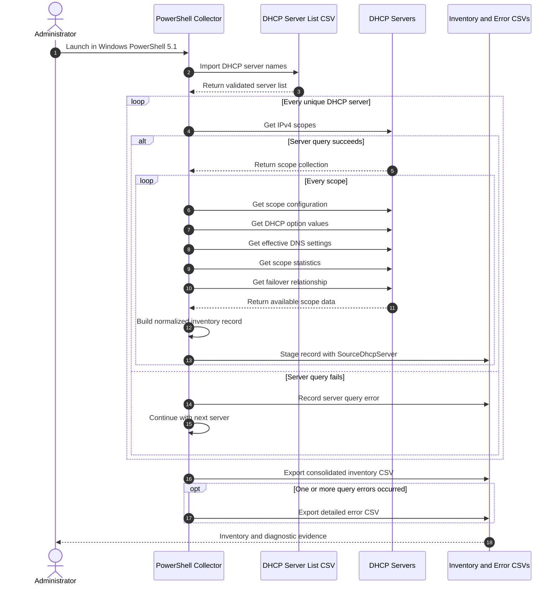

# DHCP Scope Inventory Toolkit

`Collect_DHCP_Scope_Inventory_Rev_092126.ps1` is a non-interactive Windows PowerShell 5.1 utility that collects IPv4 DHCP scope configuration, DNS behavior, failover details, and current address utilization from multiple Microsoft DHCP servers.

The utility reads DHCP server names from `DHCP_Server_List_Example_Rev_092126.csv`, queries each server independently, and writes one consolidated CSV record for every scope found on every source DHCP server. When both members of a DHCP failover relationship are included, the same scope is intentionally collected from both servers. The final `SourceDhcpServer` column identifies the server from which each record was retrieved.

## Key capabilities

- Runs without a graphical interface.
- Supports Windows Server 2022 and Windows PowerShell 5.1.
- Uses the Microsoft `DhcpServer` PowerShell module.
- Reads multiple DHCP servers from a CSV file.
- Collects one record per IPv4 scope per source DHCP server.
- Preserves records from both sides of DHCP failover relationships.
- Exports a consolidated scope inventory CSV.
- Creates a separate error CSV when individual queries fail.
- Continues processing remaining servers and scopes after recoverable errors.
- Supports downstream comparison, deduplication, and failover validation.

## Repository files

```text
Collect_DHCP_Scope_Inventory_Rev_092126.ps1
DHCP_Server_List_Example_Rev_092126.csv
README.md
wiki/
  DHCP-Scope-Inventory-Collector.md
```

## End-to-end workflow



## Requirements

- Windows Server 2022 or another supported Windows management host.
- Windows PowerShell 5.1.
- Microsoft DHCP Server management tools and the `DhcpServer` PowerShell module.
- Network connectivity to every DHCP server in the input CSV.
- An account with permission to query DHCP configuration and statistics.
- Name resolution for the DHCP server names, unless IP addresses are used.

The script assumes the required DHCP role-management components and PowerShell module are already installed.

## Input CSV

Use `DHCP_Server_List_Example_Rev_092126.csv` as the starting template.

Preferred format:

```csv
DHCPServer
dhcp01.contoso.com
dhcp02.contoso.com
```

The script accepts any one of these header names:

- `DHCPServer`
- `Server`
- `ComputerName`
- `HostName`
- `Name`

Blank values are ignored, and duplicate server names are removed before collection begins.

## Quick start

Place the script and server-list CSV in the same directory, open Windows PowerShell 5.1, and run:

```powershell
Set-Location C:\Staging

.\Collect_DHCP_Scope_Inventory_Rev_092126.ps1 `
    -ServerListPath .\DHCP_Server_List_Example_Rev_092126.csv `
    -OutputPath .\DhcpScopeInventory.csv `
    -Verbose
```

To let the script create timestamped output filenames automatically:

```powershell
.\Collect_DHCP_Scope_Inventory_Rev_092126.ps1 `
    -ServerListPath .\DHCP_Server_List_Example_Rev_092126.csv
```

## Parameters

### `ServerListPath`

Required. Path to the CSV containing DHCP server names.

### `OutputPath`

Optional. Path for the consolidated inventory CSV. If omitted, a timestamped filename is created in the current directory.

Default naming pattern:

```text
DhcpScopeInventory_yyyyMMdd_HHmmss.csv
```

### `ErrorLogPath`

Optional. Path for the detailed query-error CSV. If omitted, a timestamped filename is created in the current directory.

Default naming pattern:

```text
DhcpScopeInventory_Errors_yyyyMMdd_HHmmss.csv
```

## Output column guide

### Scope identity and addressing

- `ScopeId`: Scope network address, such as `192.168.10.0`.
- `ScopeName`: Configured DHCP scope name.
- `ScopeDescription`: Configured scope description.
- `ScopeState`: Scope state, such as `Active` or `Inactive`.
- `SubnetMask`: Scope subnet mask, such as `255.255.255.0`.
- `StartRange`: First address in the configured DHCP range.
- `EndRange`: Last address in the configured DHCP range.
- `LeaseDuration`: Lease duration in PowerShell `TimeSpan` format. For example, `8.00:00:00` means 8 days.

### Gateway and DNS options

- `GatewayOption003`: Default gateway or router configured through DHCP option 003.
- `DnsServersOption006`: DNS server addresses configured through DHCP option 006.
- `DnsDomainNameOption015`: DNS domain name configured through DHCP option 015.
- `DnsNbtNodeTypeOption046`: NetBIOS node type configured through DHCP option 046, when present.
- `DnsUpdateOption081`: Client FQDN and DNS update behavior exposed through DHCP option 081, when present.

### Effective DNS registration settings

- `DnsDynamicUpdates`
- `DnsDeleteDnsRROnLeaseExpiry`
- `DnsUpdateDnsRRForOlderClients`
- `DnsDisableDnsPtrRRUpdate`
- `DnsNameProtection`
- `DnsSettingPolicyName`

These fields represent the effective DHCP DNS settings returned for the scope. Effective values may be inherited from the DHCP server level when no scope-specific override exists.

### Failover configuration

- `FailoverEnabled`
- `FailoverRelationshipName`
- `FailoverMode`
- `FailoverServerRole`
- `FailoverPartnerServer`
- `FailoverState`
- `FailoverReservePercent`
- `FailoverLoadBalancePercent`
- `FailoverMaxClientLeadTime`
- `FailoverStateSwitchInterval`

`FailoverReservePercent` normally applies to Hot Standby relationships. `FailoverLoadBalancePercent` normally applies to Load Balance relationships. A field may therefore be blank when it does not apply to the configured mode.

### Utilization and collection metadata

- `CurrentLeasesIssued`: Addresses currently reported as in use.
- `CurrentAddressesAvailable`: Addresses currently reported as free.
- `ReservedAddresses`: Reserved address count returned by scope statistics.
- `PendingAddresses`: Pending address or offer count returned by scope statistics.
- `TotalAddresses`: Total address count when exposed by the returned statistics object.
- `PercentageInUse`: Current percentage of the address pool in use.
- `CollectedAt`: Local collection timestamp.
- `SourceDhcpServer`: DHCP server from which the scope record was collected. This is intentionally the final column.

## Failover-aware inventory behavior

When both failover partners are listed, a shared scope is expected to appear twice:

```text
ScopeId       FailoverRelationshipName    FailoverServerRole    SourceDhcpServer
10.20.30.0    SiteA-DHCP-Failover         Active                DHCP01.contoso.com
10.20.30.0    SiteA-DHCP-Failover         Standby               DHCP02.contoso.com
```

These are not accidental duplicates. Each row is the independent view returned by one DHCP server. Retaining both records supports:

- Identification of scopes present on only one partner.
- Comparison of relationship name, mode, role, state, and partner.
- Detection of scope configuration drift.
- Review of lease and address availability from each server.
- Creation of a unique-scope list by grouping records on `ScopeId` and `SubnetMask`.

Do not remove partner records until any required comparison or validation has been completed.

## Error handling

A failure against one DHCP server or one scope does not terminate the complete collection. The script records available error details and continues whenever possible.

The error CSV contains:

- `Timestamp`
- `SourceDhcpServer`
- `ScopeId`
- `Operation`
- `ErrorMessage`

Typical causes include insufficient permissions, name-resolution failures, firewall restrictions, unavailable DHCP services, and transient management connectivity problems.

## Interpreting common results

### Server returns no scopes

If a DHCP server is queried without an error but produces no inventory rows, the server may have no IPv4 scopes visible to the running account. Validate directly with:

```powershell
Get-DhcpServerv4Scope -ComputerName dhcp01.contoso.com
```

### `CommunicationInterrupted` failover state

A `FailoverState` value of `CommunicationInterrupted` requires investigation. Compare the relationship and scope inventory on both partners before relying on the relationship for redundancy.

### Blank option or setting

A blank field can mean the option is not configured, the setting does not apply to the failover mode, or the installed DHCP module did not return that property. Review the source server directly when a blank value is unexpected.

## Operational guidance

1. Include every intended DHCP server and both partners of each failover relationship in the input CSV.
2. Run the collection using an account with consistent read permissions across all servers.
3. Retain the raw consolidated CSV before performing deduplication.
4. Review the error CSV after every run.
5. Investigate failover states other than `Normal`.
6. Compare matching `ScopeId` records between partners for configuration consistency.
7. Treat `SourceDhcpServer` as evidence of where each row originated.

## Safety model

The collector is designed as a read-only inventory utility. It uses DHCP retrieval cmdlets and does not intentionally create, modify, replicate, activate, deactivate, or remove DHCP scopes or failover relationships.

Review the script in accordance with organizational change-control and security requirements before production use.
